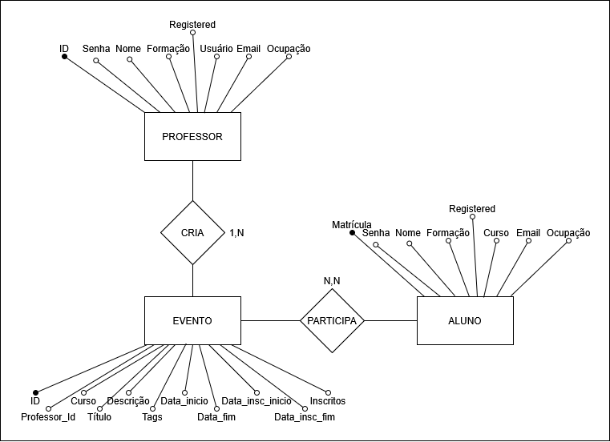
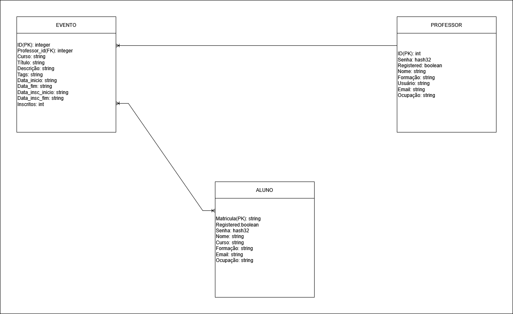

# Modelos
Segue abaixo os modelos conceitual e lógico detalhando as classes, e seus atributos, necessárias para a criação do banco de dados que atenda às funcionalidades do projeto, tal como suas relações.

## Modelo Conceitual

## Modelo Lógico
